# ER Diagram — Hospital Management System

## Complete Entity-Relationship Diagram

```mermaid
erDiagram
    ROLES {
        int id PK
        varchar name UK
        varchar description
    }
    
    USERS {
        int id PK
        varchar email UK
        varchar password
        varchar first_name
        varchar last_name
        varchar phone
        boolean is_active
        int role_id FK
    }
    
    PATIENTS {
        int id PK
        int user_id FK,UK
        date date_of_birth
        varchar gender
        varchar blood_group
        text address
        varchar emergency_contact
        text allergies
    }
    
    DOCTORS {
        int id PK
        int user_id FK,UK
        int department_id FK
        varchar specialization
        varchar qualification
        int experience
        decimal consultation_fee
        varchar license_number UK
    }
    
    NURSES {
        int id PK
        int user_id FK,UK
        int department_id FK
        varchar shift_type
        varchar ward_assignment
    }
    
    STAFF {
        int id PK
        int user_id FK,UK
        varchar designation
        int department_id FK
    }
    
    DEPARTMENTS {
        int id PK
        varchar name UK
        text description
        varchar head_of_dept
        varchar floor
    }
    
    APPOINTMENTS {
        int id PK
        int patient_id FK
        int doctor_id FK
        timestamp appointment_date
        varchar time_slot
        varchar status
        varchar type
        text reason
    }
    
    DOCTOR_SCHEDULES {
        int id PK
        int doctor_id FK
        varchar day_of_week
        varchar start_time
        varchar end_time
        int slot_duration
    }
    
    PRESCRIPTIONS {
        int id PK
        int patient_id FK
        int doctor_id FK
        int appointment_id FK,UK
        text diagnosis_notes
        text instructions
        date follow_up_date
    }
    
    PRESCRIPTION_ITEMS {
        int id PK
        int prescription_id FK
        int medication_id FK
        varchar dosage
        varchar frequency
        varchar duration
    }
    
    MEDICATIONS {
        int id PK
        varchar name
        varchar generic_name
        varchar category
        varchar dosage_form
        decimal price
    }
    
    LAB_TESTS {
        int id PK
        varchar name
        varchar category
        decimal cost
        varchar normal_range
    }
    
    LAB_ORDERS {
        int id PK
        int patient_id FK
        int doctor_id FK
        int lab_test_id FK
        varchar status
        varchar priority
    }
    
    LAB_REPORTS {
        int id PK
        int lab_order_id FK,UK
        text result
        varchar result_value
        text remarks
        varchar reported_by
    }
    
    MEDICAL_RECORDS {
        int id PK
        int patient_id FK
        varchar record_type
        varchar title
        text description
    }
    
    VITALS {
        int id PK
        int patient_id FK
        int nurse_id FK
        varchar blood_pressure
        int heart_rate
        decimal temperature
        decimal oxygen_saturation
    }
    
    DIAGNOSES {
        int id PK
        int patient_id FK
        int doctor_id FK
        varchar condition
        varchar severity
        varchar icd_code
    }
    
    TREATMENT_PLANS {
        int id PK
        int diagnosis_id FK
        text plan_details
        date start_date
        date end_date
        varchar status
    }
    
    ROOMS {
        int id PK
        varchar room_number UK
        int department_id FK
        varchar type
        varchar floor
        decimal charges
    }
    
    BEDS {
        int id PK
        int room_id FK
        varchar bed_number
        boolean is_occupied
    }
    
    ROOM_ASSIGNMENTS {
        int id PK
        int patient_id FK
        int bed_id FK
        timestamp assigned_at
        timestamp discharged_at
        varchar status
    }
    
    ADMISSIONS {
        int id PK
        int patient_id FK
        timestamp admit_date
        text reason
        varchar status
    }
    
    DISCHARGES {
        int id PK
        int admission_id FK,UK
        timestamp discharge_date
        text summary
        varchar discharged_by
    }
    
    BILLING {
        int id PK
        int patient_id FK
        int appointment_id FK,UK
        decimal total_amount
        decimal discount
        decimal tax
        decimal net_amount
        varchar status
    }
    
    BILLING_ITEMS {
        int id PK
        int billing_id FK
        varchar description
        varchar category
        int quantity
        decimal unit_price
        decimal total_price
    }
    
    PAYMENTS {
        int id PK
        int billing_id FK
        decimal amount
        varchar payment_method
        varchar transaction_id
        varchar status
    }
    
    INSURANCE {
        int id PK
        int patient_id FK,UK
        varchar provider
        varchar policy_number
        varchar coverage_type
        date valid_from
        date valid_to
        decimal max_coverage
    }
    
    PHARMACY_ORDERS {
        int id PK
        int prescription_id FK
        varchar status
        varchar dispensed_by
        decimal total_cost
    }
    
    INVENTORY {
        int id PK
        int medication_id FK
        varchar item_name
        varchar category
        int quantity
        int reorder_level
        varchar supplier
    }
    
    EQUIPMENT {
        int id PK
        varchar name
        varchar category
        varchar serial_number UK
        varchar status
        decimal cost
    }
    
    FEEDBACK {
        int id PK
        int patient_id FK
        int doctor_id FK
        int rating
        text comment
        varchar category
    }
    
    FAQ {
        int id PK
        text question
        text answer
        varchar category
        text keywords
    }
    
    NOTIFICATIONS {
        int id PK
        int user_id FK
        varchar title
        text message
        varchar type
        boolean is_read
    }
    
    SYMPTOM_DISEASE_MAP {
        int id PK
        varchar symptom
        varchar disease
        varchar specialization
        decimal probability
    }
    
    EMERGENCY_CASES {
        int id PK
        int patient_id FK
        text description
        varchar severity
        varchar status
    }
    
    AUDIT_LOG {
        int id PK
        int user_id FK
        varchar action
        varchar table_name
        int record_id
    }

    %% RELATIONSHIPS

    ROLES ||--o{ USERS : "has"
    USERS ||--o| PATIENTS : "is"
    USERS ||--o| DOCTORS : "is"
    USERS ||--o| NURSES : "is"
    USERS ||--o| STAFF : "is"
    USERS ||--o{ NOTIFICATIONS : "receives"
    USERS ||--o{ AUDIT_LOG : "generates"

    DEPARTMENTS ||--o{ DOCTORS : "employs"
    DEPARTMENTS ||--o{ NURSES : "includes"
    DEPARTMENTS ||--o{ STAFF : "includes"
    DEPARTMENTS ||--o{ ROOMS : "contains"

    PATIENTS ||--o{ APPOINTMENTS : "books"
    DOCTORS ||--o{ APPOINTMENTS : "attends"
    APPOINTMENTS ||--o| PRESCRIPTIONS : "results_in"
    APPOINTMENTS ||--o| BILLING : "generates"

    DOCTORS ||--o{ DOCTOR_SCHEDULES : "has"
    DOCTORS ||--o{ PRESCRIPTIONS : "writes"
    PATIENTS ||--o{ PRESCRIPTIONS : "receives"
    PRESCRIPTIONS ||--o{ PRESCRIPTION_ITEMS : "contains"
    PRESCRIPTION_ITEMS }o--|| MEDICATIONS : "references"
    PRESCRIPTIONS ||--o{ PHARMACY_ORDERS : "fulfilled_by"

    PATIENTS ||--o{ LAB_ORDERS : "undergoes"
    DOCTORS ||--o{ LAB_ORDERS : "orders"
    LAB_ORDERS }o--|| LAB_TESTS : "for"
    LAB_ORDERS ||--o| LAB_REPORTS : "produces"

    PATIENTS ||--o{ MEDICAL_RECORDS : "has"
    PATIENTS ||--o{ VITALS : "recorded"
    NURSES ||--o{ VITALS : "records"
    PATIENTS ||--o{ DIAGNOSES : "diagnosed"
    DOCTORS ||--o{ DIAGNOSES : "diagnoses"
    DIAGNOSES ||--o{ TREATMENT_PLANS : "treated_by"

    ROOMS ||--o{ BEDS : "contains"
    BEDS ||--o{ ROOM_ASSIGNMENTS : "assigned"
    PATIENTS ||--o{ ROOM_ASSIGNMENTS : "stays"
    PATIENTS ||--o{ ADMISSIONS : "admitted"
    ADMISSIONS ||--o| DISCHARGES : "discharged"

    PATIENTS ||--o{ BILLING : "billed"
    BILLING ||--o{ BILLING_ITEMS : "includes"
    BILLING ||--o{ PAYMENTS : "paid_by"
    PATIENTS ||--o| INSURANCE : "insured"

    MEDICATIONS ||--o{ INVENTORY : "stocked"
    PATIENTS ||--o{ FEEDBACK : "gives"
    DOCTORS ||--o{ FEEDBACK : "receives"
    PATIENTS ||--o{ EMERGENCY_CASES : "reported"
```

## Relationship Summary

### One-to-One (1:1)
| Entity A | Entity B | Description |
|---|---|---|
| User | Patient | One user can be one patient |
| User | Doctor | One user                                   can be one doctor |
| User | Nurse | One user can be one nurse |
| User | Staff | One user can be one staff member |
| Appointment | Prescription | One appointment results in one prescription |
| Appointment | Billing | One appointment generates one bill |
| Lab Order | Lab Report | One order produces one report |
| Admission | Discharge | One admission has one discharge |
| Patient | Insurance | One patient has one insurance |

### One-to-Many (1:M)
| Entity (One) | Entity (Many) | Description |
|---|---|---|
| Role | Users | One role has many users |
| Department | Doctors | One department has many doctors |
| Department | Rooms | One department has many rooms |
| Patient | Appointments | One patient books many appointments |
| Doctor | Appointments | One doctor has many appointments |
| Doctor | Schedules | One doctor has many schedule slots |
| Prescription | Prescription_Items | One prescription has many items |
| Patient | Lab Orders | One patient has many lab orders |
| Patient | Vitals | One patient has many vital records |
| Patient | Diagnoses | One patient has many diagnoses |
| Diagnosis | Treatment Plans | One diagnosis has many treatment plans |
| Room | Beds | One room has many beds |
| Billing | Billing Items | One bill has many line items |
| Billing | Payments | One bill can have many payments |
| User | Notifications | One user receives many notifications |

### Many-to-Many (M:N)
| Entity A | Entity B | Junction Table | Description |
|---|---|---|---|
| Prescriptions | Medications | Prescription_Items | Many medications in many prescriptions |
| Patients | Beds | Room_Assignments | Patients assigned to beds over time |
